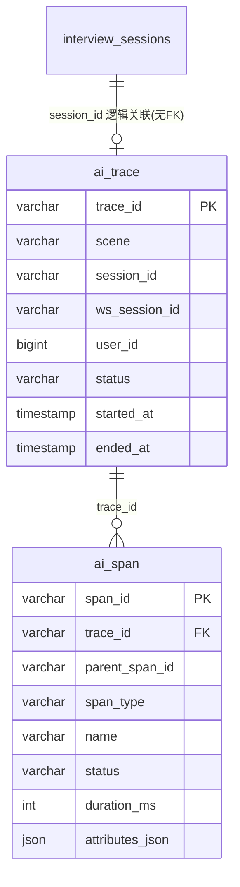

# AI 全链路分析 — 数据库设计

> **需求来源：** [prd_ai_full_link_analysis.md](./prd_ai_full_link_analysis.md) · [tech_design_ai_full_link_analysis.md](./tech_design_ai_full_link_analysis.md)  
> **功能短名：** `ai_full_link_analysis`  
> **状态：** DRAFT — 库表设计；API 契约与编码另项点名  
> **库：** MySQL 8 · 库名沿用 `interview_agent`  
> **落地方式：** 与现网一致，优先 JPA Entity + `ddl-auto: update`；下文 DDL 为权威结构说明（便于评审与手工建库）

---

## 1. 设计目标

| 目标 | 库表侧做法 |
|------|------------|
| 按 `traceId` 还原时间线 | `ai_span.trace_id` + `(trace_id, started_at)` 索引 |
| Token / RAG / Tool / Agent 聚合 | span 上冗余关键度量列，减少扫 `attributes_json` |
| 低侵入异步写入 | 表结构支持批量 insert；无重外键级联拖垮主链路 |
| 隐私 | 不存 prompt / JD / 简历原文；错误信息截断 |
| 可清理 | 以时间字段支撑按 `retain-days` 删除 |

**非目标：** MVP 不上日汇总表、不上分库分表、不强制 FK 到 `interview_sessions`（避免面试删档牵连观测，且观测可独立保留策略）。

---

## 2. ER 概览



说明：

- `ai_trace.session_id` **逻辑关联** `interview_sessions.id`，**不建物理外键**。
- 一场面试：通常 1 条 `ai_trace` + 多条 `ai_span`；chat/skill：1 trace + 少量 span。

---

## 3. 表定义

### 3.1 `ai_trace` — 一次可观测请求/一场面试根

| 列名 | 类型 | 空 | 默认 | 说明 |
|------|------|----|------|------|
| `trace_id` | `VARCHAR(64)` | NO | — | PK；UUID 去横线或标准 UUID 字符串 |
| `scene` | `VARCHAR(32)` | NO | — | `CHAT` / `SKILL` / `INTERVIEW` / `UPLOAD` / `OTHER` |
| `session_id` | `VARCHAR(64)` | YES | NULL | 面试会话 id；非面试可空 |
| `ws_session_id` | `VARCHAR(128)` | YES | NULL | WebSocket `session.getId()` |
| `user_id` | `BIGINT` | YES | NULL | 可空（现网 WS 常未传 userId） |
| `status` | `VARCHAR(16)` | NO | `RUNNING` | `RUNNING` / `OK` / `ERROR` / `CANCELLED` |
| `started_at` | `DATETIME(3)` | NO | — | 毫秒精度 |
| `ended_at` | `DATETIME(3)` | YES | NULL | root 结束时回填 |
| `error_summary` | `VARCHAR(512)` | YES | NULL | 根级失败摘要，截断 |
| `dropped_child_hint` | `INT` | YES | 0 | 可选：该 trace 下因队列满丢弃的 span 计数（近似） |
| `created_at` | `DATETIME(3)` | NO | CURRENT_TIMESTAMP(3) | 行插入时间 |

```sql
CREATE TABLE ai_trace (
    trace_id           VARCHAR(64)  NOT NULL,
    scene              VARCHAR(32)  NOT NULL,
    session_id         VARCHAR(64)  NULL,
    ws_session_id      VARCHAR(128) NULL,
    user_id            BIGINT       NULL,
    status             VARCHAR(16)  NOT NULL DEFAULT 'RUNNING',
    started_at         DATETIME(3)  NOT NULL,
    ended_at           DATETIME(3)  NULL,
    error_summary      VARCHAR(512) NULL,
    dropped_child_hint INT          NULL DEFAULT 0,
    created_at         DATETIME(3)  NOT NULL DEFAULT CURRENT_TIMESTAMP(3),
    PRIMARY KEY (trace_id),
    KEY idx_ai_trace_started (started_at),
    KEY idx_ai_trace_scene_started (scene, started_at),
    KEY idx_ai_trace_session (session_id),
    KEY idx_ai_trace_user_started (user_id, started_at)
) ENGINE=InnoDB DEFAULT CHARSET=utf8mb4 COLLATE=utf8mb4_unicode_ci;
```

### 3.2 `ai_span` — 链路节点事件

| 列名 | 类型 | 空 | 默认 | 说明 |
|------|------|----|------|------|
| `span_id` | `VARCHAR(64)` | NO | — | PK |
| `trace_id` | `VARCHAR(64)` | NO | — | 所属 trace |
| `parent_span_id` | `VARCHAR(64)` | YES | NULL | 根 span 可空或指向 ROOT |
| `span_type` | `VARCHAR(16)` | NO | — | `ROOT` / `AGENT` / `LLM` / `RAG` / `TOOL` / `EMBED` |
| `name` | `VARCHAR(128)` | NO | — | 如 `agent.analyze_jd`、`llm.chat`、`rag.retrieve`、`tool.skill.QuickQuizSkill` |
| `status` | `VARCHAR(16)` | NO | — | `OK` / `ERROR` / `UNSET` |
| `started_at` | `DATETIME(3)` | NO | — | |
| `ended_at` | `DATETIME(3)` | YES | NULL | 未正常结束可空 |
| `duration_ms` | `INT` | YES | NULL | `ended_at - started_at`；等待人工答题建议不计入 AGENT（见技术方案待确认） |
| `agent` | `VARCHAR(64)` | YES | NULL | 冗余：如 `JdAnalysisAgent` |
| `node` | `VARCHAR(64)` | YES | NULL | 冗余：Graph 节点名 `analyze_jd` |
| `model` | `VARCHAR(64)` | YES | NULL | LLM/Embedding 模型名 |
| `tool_name` | `VARCHAR(64)` | YES | NULL | Skill 名 |
| `prompt_tokens` | `INT` | YES | NULL | LLM；Usage 缺失则为 NULL |
| `completion_tokens` | `INT` | YES | NULL | |
| `total_tokens` | `INT` | YES | NULL | |
| `cost_amount` | `DECIMAL(18,8)` | YES | NULL | 估算成本数值 |
| `cost_currency` | `CHAR(3)` | YES | NULL | 如 `CNY` / `USD`；与配置一致 |
| `rag_candidate_count` | `INT` | YES | NULL | RAG |
| `rag_empty` | `TINYINT(1)` | YES | NULL | 1=空结果 |
| `rag_hit` | `TINYINT(1)` | YES | NULL | 1=检索返回非空 |
| `rag_reranked` | `TINYINT(1)` | YES | NULL | 1=发生重排调用 |
| `rag_rerank_fallback` | `TINYINT(1)` | YES | NULL | 1=重排失败降级 |
| `error_type` | `VARCHAR(128)` | YES | NULL | 异常简名 |
| `error_message` | `VARCHAR(512)` | YES | NULL | 截断后的错误信息 |
| `attributes_json` | `JSON` | YES | NULL | 扩展属性（见 §5）；禁止存原文 prompt/JD/简历 |
| `created_at` | `DATETIME(3)` | NO | CURRENT_TIMESTAMP(3) | |

```sql
CREATE TABLE ai_span (
    span_id              VARCHAR(64)    NOT NULL,
    trace_id             VARCHAR(64)    NOT NULL,
    parent_span_id       VARCHAR(64)    NULL,
    span_type            VARCHAR(16)    NOT NULL,
    name                 VARCHAR(128)   NOT NULL,
    status               VARCHAR(16)    NOT NULL,
    started_at           DATETIME(3)    NOT NULL,
    ended_at             DATETIME(3)    NULL,
    duration_ms          INT            NULL,
    agent                VARCHAR(64)    NULL,
    node                 VARCHAR(64)    NULL,
    model                VARCHAR(64)    NULL,
    tool_name            VARCHAR(64)    NULL,
    prompt_tokens        INT            NULL,
    completion_tokens    INT            NULL,
    total_tokens         INT            NULL,
    cost_amount          DECIMAL(18,8)  NULL,
    cost_currency        CHAR(3)        NULL,
    rag_candidate_count  INT            NULL,
    rag_empty            TINYINT(1)     NULL,
    rag_hit              TINYINT(1)     NULL,
    rag_reranked         TINYINT(1)     NULL,
    rag_rerank_fallback  TINYINT(1)     NULL,
    error_type           VARCHAR(128)   NULL,
    error_message        VARCHAR(512)   NULL,
    attributes_json      JSON           NULL,
    created_at           DATETIME(3)    NOT NULL DEFAULT CURRENT_TIMESTAMP(3),
    PRIMARY KEY (span_id),
    KEY idx_ai_span_trace_started (trace_id, started_at),
    KEY idx_ai_span_type_started (span_type, started_at),
    KEY idx_ai_span_llm_agg (span_type, started_at, agent, node, model),
    KEY idx_ai_span_tool_agg (span_type, tool_name, started_at),
    KEY idx_ai_span_agent_agg (span_type, node, started_at),
    KEY idx_ai_span_parent (parent_span_id),
    CONSTRAINT fk_ai_span_trace
        FOREIGN KEY (trace_id) REFERENCES ai_trace (trace_id)
        ON DELETE CASCADE
) ENGINE=InnoDB DEFAULT CHARSET=utf8mb4 COLLATE=utf8mb4_unicode_ci;
```

**外键策略：** `ai_span → ai_trace` 使用 `ON DELETE CASCADE`，便于按 trace 或按时间删父行时清理子行。写入顺序必须先 `ai_trace` 再 `ai_span`（异步 writer 需保证同 batch 内顺序或 upsert trace）。

若担心 CASCADE 锁：可改为**无物理 FK**，清理时先删 span 再删 trace（待确认；默认保留 FK + CASCADE，因观测表由本系统独占写入）。

---

## 4. 枚举与取值约定

### 4.1 `scene`

| 值 | 含义 |
|----|------|
| `CHAT` | 未命中 Skill 的闲聊 |
| `SKILL` | Skill 处理的消息（也可统一记 CHAT，用 TOOL span 区分；**推荐 root scene=`SKILL`**） |
| `INTERVIEW` | `start_interview` 整场 |
| `UPLOAD` | 题库上传 |
| `OTHER` | 其它 |

### 4.2 `span_type` / `status`

见技术方案 §4.2；库内用 `VARCHAR`，应用层常量校验，避免 MySQL ENUM 变更麻烦。

### 4.3 `name` 命名

| 模式 | 示例 |
|------|------|
| `root.{wsType}` | `root.chat`、`root.start_interview` |
| `agent.{node\|agent}` | `agent.analyze_jd`、`agent.chat` |
| `llm.chat` / `llm.rerank` | |
| `rag.retrieve` | |
| `tool.skill.{SimpleClassName}` | `tool.skill.QuickQuizSkill` |
| `embed.query` | 可选增强 |

---

## 5. `attributes_json` 约定

仅存**结构化扩展**，体积建议单行 &lt; 4KB。

**允许示例：**

```json
{
  "promptChars": 1200,
  "completionChars": 340,
  "promptHash": "sha256:...",
  "topQuestionIds": ["q1", "q2"],
  "bankSize": 120,
  "generatedQuestionCount": 2,
  "bankQuestionCount": 3,
  "wsType": "chat",
  "usageMissing": true
}
```

**禁止：**

- prompt / completion 全文
- JD、简历、用户聊天原文
- 完整 `ChatResponse` 序列化

---

## 6. 索引与查询模式映射

| 查询 | 使用索引 |
|------|----------|
| 按 `trace_id` 时间线 | `PRIMARY`/`idx_ai_span_trace_started` |
| 按时间 + scene 列 trace | `idx_ai_trace_scene_started` |
| 按 `session_id` 找面试 trace | `idx_ai_trace_session` |
| Token 聚合 | `idx_ai_span_llm_agg` + `WHERE span_type='LLM'` |
| Tool 成功率 | `idx_ai_span_tool_agg` + `span_type='TOOL'` |
| Agent 健康度 | `idx_ai_span_agent_agg` + `span_type='AGENT'` |
| RAG 效果 | `idx_ai_span_type_started` + `span_type='RAG'` 过滤冗余列 |

---

## 7. 示例聚合 SQL（口径对齐技术方案）

### 7.1 Token / 成本（按 agent + model）

```sql
SELECT agent, node, model,
       COUNT(*) AS llm_calls,
       SUM(IFNULL(prompt_tokens, 0)) AS sum_prompt,
       SUM(IFNULL(completion_tokens, 0)) AS sum_completion,
       SUM(IFNULL(cost_amount, 0)) AS sum_cost,
       SUM(CASE WHEN prompt_tokens IS NULL THEN 1 ELSE 0 END) AS usage_missing
FROM ai_span
WHERE span_type = 'LLM'
  AND started_at >= ? AND started_at < ?
GROUP BY agent, node, model;
```

### 7.2 RAG 效果

```sql
SELECT
  COUNT(*) AS retrieves,
  SUM(rag_empty = 1) AS empty_cnt,
  SUM(rag_hit = 1) AS hit_cnt,
  SUM(rag_reranked = 1) AS rerank_cnt,
  SUM(rag_rerank_fallback = 1) AS rerank_fallback_cnt,
  AVG(duration_ms) AS avg_ms
FROM ai_span
WHERE span_type = 'RAG'
  AND started_at >= ? AND started_at < ?;
```

### 7.3 Tool 成功率

```sql
SELECT tool_name,
       COUNT(*) AS calls,
       SUM(status = 'OK') AS ok_cnt,
       SUM(status = 'ERROR') AS err_cnt,
       ROUND(SUM(status = 'OK') / COUNT(*), 4) AS success_rate
FROM ai_span
WHERE span_type = 'TOOL'
  AND started_at >= ? AND started_at < ?
GROUP BY tool_name;
```

### 7.4 Agent 执行健康度

```sql
SELECT node, agent,
       COUNT(*) AS runs,
       SUM(status = 'OK') AS ok_cnt,
       ROUND(SUM(status = 'OK') / COUNT(*), 4) AS success_rate,
       AVG(duration_ms) AS avg_ms
FROM ai_span
WHERE span_type = 'AGENT'
  AND started_at >= ? AND started_at < ?
GROUP BY node, agent;
```

### 7.5 单 trace 时间线

```sql
SELECT span_id, parent_span_id, span_type, name, status,
       started_at, ended_at, duration_ms,
       prompt_tokens, completion_tokens, cost_amount,
       tool_name, rag_empty, rag_hit, error_type, error_message
FROM ai_span
WHERE trace_id = ?
ORDER BY started_at ASC, span_id ASC;
```

---

## 8. 写入与一致性

| 规则 | 说明 |
|------|------|
| 顺序 | 先确保 `ai_trace` 存在（root 开始时 insert），再 insert/update spans |
| 更新 | span 建议 **单次 insert 完整结束态**（内存持有 start，end 时写一行），避免高频 update；若需 start 先落库，则 end 时 `UPDATE` |
| MVP 推荐 | **仅在 span end 时写一行**（含 started_at/ended_at）；trace 在 root start insert `RUNNING`，root end 时 `UPDATE` status/ended_at |
| 队列满丢弃 | 不写库；可选增加内存/日志计数；`dropped_child_hint` 尽力更新（允许不精确） |
| 事务 | 批量 `saveAll` 可用小事务；失败重试有限次后丢弃并打错误日志 |

---

## 9. 保留与清理

| 项 | 建议 |
|----|------|
| 默认保留 | `app.observability.retain-days: 14`（与技术方案一致） |
| 清理方式 | 定时任务：先删过期 `ai_trace`（CASCADE 删 span），或 `DELETE FROM ai_span WHERE started_at < ?` 再删 trace |
| 批大小 | 每次限 1000～5000 行，避免长事务锁表 |
| 与面试会话 | **不**随 `interview_sessions` 删除而自动删观测数据（便于事后复盘）；过期仅看观测保留期 |

```sql
-- 示例：按 ended_at/started_at 清理（应用层循环执行）
DELETE FROM ai_trace
WHERE started_at < (UTC_TIMESTAMP(3) - INTERVAL ? DAY)
LIMIT 1000;
```

---

## 10. 与现有表关系

| 现有表 | 关系 |
|--------|------|
| `interview_sessions` | `ai_trace.session_id` = `interview_sessions.id`（逻辑关联，无 FK） |
| `users` | `ai_trace.user_id` 逻辑关联，可空 |
| `weakness_records` | 无直接关系 |

**不修改**现有业务表结构；观测数据独立演进。

---

## 11. JPA 映射建议（实现备忘，非 Task）

| 表 | 建议 Entity | Id 策略 |
|----|-------------|---------|
| `ai_trace` | `AiTraceEntity` | 应用生成 `traceId` 字符串 |
| `ai_span` | `AiSpanEntity` | 应用生成 `spanId` 字符串 |

- 时间类型：`Instant` ↔ `DATETIME(3)`
- `attributes_json`：`String` + `@JdbcTypeCode(SqlTypes.JSON)` 或 `columnDefinition = "json"`
- 包路径建议：`com.interview.agent.observability.store`（与技术方案一致）

项目当前无 Flyway/Liquibase；MVP 跟随 `ddl-auto: update`。若后续上迁移工具，以本文 DDL 为初始 baseline。

---

## 12. 容量粗估（量级感）

假设一场面试 ≈ 8 个 AGENT + 10 个 LLM + 3 个 RAG + 1 ROOT ≈ **25 spans**，每天 200 场 ≈ 5,000 spans + 200 traces。  
14 天 ≈ 7 万 span 行 —— 单机 MySQL 聚合可接受，**无需** MVP 汇总表。

若日 span &gt; 50 万，再评估：

- 按月分区（`started_at`）
- 或日汇总表 `ai_span_daily_agg`（另立变更）

---

## 13. 待确认

- [保留] `ai_span → ai_trace` 是否保留物理 FK + CASCADE？（本文默认保留）
- [写入] span 写入模式：仅 end 时 insert vs start/end 两次写？
- [CNY] `cost_currency` 默认 `CNY` 还是 `USD`？
- [一律CHAT] `SKILL` 是否独立 `scene`，还是 root 一律 `CHAT`？
- [需要] 是否需要第三张表专门记「队列丢弃指标」（全局计数）？

---

*Status: DRAFT — 数据库设计。API / Task / 编码需你另行点名。*
