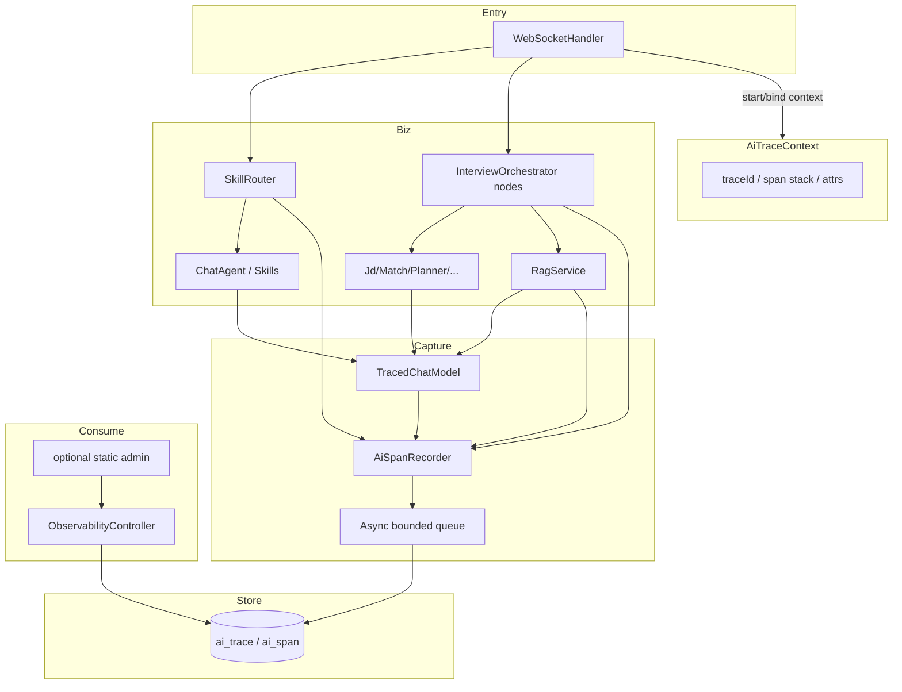

# AI 全链路分析 — 技术方案

> **需求来源：** [prd_ai_full_link_analysis.md](./prd_ai_full_link_analysis.md)  
> **功能短名：** `ai_full_link_analysis`  
> **状态：** DRAFT — 技术设计；库表细则 / API 契约 / Task 拆分另项点名  
> **边界：** 写架构选型、模块划分、埋点策略、数据模型概念、消费面与风险；**不写**完整 DDL、接口字段表、实现任务清单

---

## 1. 目标与非目标

### 1.1 目标（对齐 PRD MVP）

| 目标 | 技术含义 |
|------|----------|
| traceId 串联 | 一次 WS 入站 / 一场面试 Graph 运行可还原 AI 相关 span 时间线 |
| Token 成本 | 每次 LLM 调用可归因到场景 / Agent / Graph 节点，可聚合 |
| RAG 效果 | 每次检索可统计空结果、题库命中、LLM 兜底、重排、耗时 |
| Tool 成功率 | 现有 Skill 调用可统计成功/失败/耗时（当前无 Spring AI `@Tool`） |
| Agent 执行质量 | Graph 节点 / Agent 级成功率、耗时、错误摘要（执行健康度） |
| 低侵入 | 主链路不因观测同步写库而明显变慢；业务代码少散落埋点 |

### 1.2 非目标

- 不替代 JVM/HTTP 通用 APM
- 不引入商业 LLM Observability SaaS（MVP）
- 不存 prompt/简历/JD 全文
- 不做 LLM-as-Judge 语义质量分
- 不改求职者主流程产品 UI（观测面独立）

---

## 2. 现状约束（设计输入）

| 事实 | 影响 |
|------|------|
| 入口主要是 `WebSocketHandler`（`/ws`），面试在 `interviewExecutor` 异步跑 Graph | 必须做 **上下文跨线程传播**（不能只靠普通 ThreadLocal） |
| LLM 统一 `ChatModel.call(Prompt)`，约 11 处调用方，**未读 Usage** | 优先 **装饰 `ChatModel`** 集中采 Token，避免改遍所有 Agent |
| RAG：`RagService.retrieveBest`；命中信号在 Planner 侧 `QuestionSource.BANK\|GENERATED` | RAG span 在 `RagService`；「是否兜底出题」在 Planner 再记一条或补 attribute |
| Tool ≈ `SkillRouter` + 两个 Skill；无 MCP Tool | Tool 维度 MVP = Skill 调用 |
| 已有 MySQL + JPA；无 Actuator / Micrometer / OTel | MVP **自建观测模块 + MySQL 落库**；不强制先上 OTel |
| 面试 `sessionId` 与 WS `session.getId()` 是两套 ID | 观测模型同时保留 `traceId`、`sessionId`（可空）、`wsSessionId`（可空） |
| `AUTH_ENABLED` 默认 false | Admin 查询接口需独立开关 / 密钥，避免观测数据裸奔 |

---

## 3. 总体方案

### 3.1 一句话

在单体应用内新增 `observability` 包：以 **`traceId` + `span` 事件模型** 采集 AI 语义链路，**异步写入 MySQL**；通过 **装饰 `ChatModel` + 少量业务切点**（WS 入口、Graph 节点、RAG、Skill）覆盖 Token / RAG / Tool / Agent 四个投影；提供 **只读查询 API**（可选简易 Admin 页）按 trace 复盘与按维度聚合。

### 3.2 架构图



### 3.3 为何不先上 OpenTelemetry

| 选项 | 优点 | 缺点 | MVP 结论 |
|------|------|------|----------|
| A. 自建 span 表 + 查询 API | 与现有 MySQL/JPA 一致；AI 属性（token/rag/tool）一等公民；实现可控 | 非标准生态；以后若接 Grafana 需适配 | **采用** |
| B. OTel SDK + 导出器 | 标准、可接 Jaeger/Tempo | 依赖与运维变重；Token/RAG 自定义属性仍要自建语义；本地演示成本高 | 里程碑可选 |
| C. 仅日志 MDC | 改动小 | 无法可靠聚合 Token/RAG/成功率 | 否决作主方案（日志可作补充） |

预留：span 模型字段对齐 OTel 习惯（`traceId`/`spanId`/`parentSpanId`/`name`/`start`/`end`/`status`/`attributes`），便于日后导出。

---

## 4. Trace / Span 模型

### 4.1 ID 生命周期（推荐默认，可待确认）

| 场景 | `traceId` | `sessionId` | 说明 |
|------|-----------|-------------|------|
| `chat` / Skill | 每条 WS 消息新建 | 空或未来业务会话 id | 单次问答一条 trace |
| `upload_questions` | 每条 WS 消息新建 | 空 | 含解析 LLM fallback 时可挂 LLM span |
| `start_interview` | **整场 Graph `run()` 共用一个 `traceId`** | `interviewSessionId` | 节点 = 子 span；跨 `answer` 等待仍属同一 trace |
| `answer` / `quit` | **复用**该场面试的 `traceId` | 同上 | 在 handler 侧从 `activeInterviewByWs` 取回并 bind |

嵌套关系：

```text
trace (start_interview)
├── span agent.analyze_jd
│   └── span llm.chat (TracedChatModel)
├── span agent.match_resume
│   └── span llm.chat
├── span agent.plan_questions
│   ├── span rag.retrieve
│   │   └── span llm.rerank   (若发生)
│   └── span llm.chat         (生成题 / 规划)
├── span agent.ask_question
├── span agent.grade_answer
│   └── span llm.chat
├── ...
├── span agent.evaluate
└── span agent.review
```

Chat/Skill：

```text
trace (chat message)
├── span tool.skill.{name}     (若命中 Skill)
│   └── span llm.chat
└── 或 span agent.chat
    └── span llm.chat
```

### 4.2 Span 类型（`spanType`）

| spanType | 用途 | 主要 attributes |
|----------|------|-----------------|
| `ROOT` | 入站请求根 | `scene`, `wsType`, `wsSessionId` |
| `AGENT` | Graph 节点或业务 Agent | `agent`, `node`, `success`, `errorType` |
| `LLM` | 单次 `ChatModel.call` | `model`, `promptTokens`, `completionTokens`, `totalTokens`, `costUsd|costCny`, `owner` |
| `RAG` | 单次 `retrieveBest` | `candidateCount`, `hit`, `reranked`, `empty`, `latencyMs`, `topQuestionIds` |
| `TOOL` | Skill 调用 | `toolName`, `success`, `errorType` |
| `EMBED` | Embedding 调用（可选 MVP+） | `model`, `latencyMs`, `success` |

`scene` 枚举建议：`CHAT` | `SKILL` | `INTERVIEW` | `UPLOAD` | `OTHER`。

### 4.3 上下文传播

- 核心类：`AiTraceContext`（包装 `traceId`、当前 `spanId` 栈、`scene`、`sessionId`、`attrs`）。
- WS 线程：`handleTextMessage` 入口 `openRoot(...)`，`finally clear()`。
- 面试异步：提交 `interviewExecutor` 前 **capture**，任务内 **restore**（类似 `TaskDecorator` / 显式 wrapper）。
- Graph 节点若在公共线程池执行：同样在节点包装层 restore（见 §6）。

---

## 5. 模块划分（建议包结构）

```text
com.interview.agent.observability
├── AiTraceContext
├── AiSpan             // 内存 DTO
├── SpanType / SpanStatus
├── AiSpanRecorder     // start/end/record 事件 → 入队
├── TracedChatModel    // 装饰 ChatModel，统一 Token
├── ObservabilityProperties  // app.observability.*
├── TokenPricingService      // 按模型计价
├── store/
│   ├── AiTraceEntity / AiSpanEntity
│   ├── AiTraceRepository / AiSpanRepository
│   └── AsyncSpanWriter      // 有界队列 + 批量 flush
├── query/
│   ├── ObservabilityQueryService
│   └── Aggregates（Token/RAG/Tool/Agent）
└── web/
    └── ObservabilityController   // 只读 API
```

配置开关（建议）：

```yaml
app:
  observability:
    enabled: true
    retain-days: 14
    queue-capacity: 10000
    flush-batch-size: 100
    store-prompt: false          # 默认 false
    admin-token: ${OBS_ADMIN_TOKEN:}   # 非空才开放查询；待确认是否复用 JWT role
    pricing:
      qwen-plus:
        input-per-1k: 0.0008     # 单位待确认（人民币/美元）
        output-per-1k: 0.002
```

---

## 6. 埋点策略（低侵入优先）

### 6.1 集中点（必须）

| 切点 | 文件/位置 | 采集 |
|------|-----------|------|
| WS 入站 | `WebSocketHandler#handleTextMessage` | 创建/绑定 root；`chat`/`upload` 每消息新 trace；`answer`/`quit` 复用面试 trace |
| 面试启动 | `handleStartInterview` + 提交 executor 时 | 生成 `traceId`，与 `interviewSessionId` 一并传入 `run` 或 Thread context |
| LLM | 新 `TracedChatModel` 替代裸 `ChatModel` bean | `LLM` span：耗时、status、Usage→Token、计价、当前 context 的 agent/node |
| RAG | `RagService#retrieveBest` | `RAG` span：候选数、empty、是否返回、rerank 是否调用、耗时、top ids |
| Skill | `SkillRouter#route` | 命中则 `TOOL` span；内部 LLM 自动挂到当前 span 下 |
| Graph 节点 | `InterviewOrchestrator` 各 node 方法外包一层 | `AGENT` span：node 名、success/fail、错误摘要、耗时 |

### 6.2 Token 采集细节

- 从 `ChatResponse.getMetadata().getUsage()` 读取 prompt/completion/total（若 DashScope 适配器未填 Usage：**记录 null + 打点缺失率**，不阻塞主流程）。
- `owner` 从 `AiTraceContext` 读取（Agent 入口 `context.setAttr("agent", "JdAnalysisAgent")`，或 Graph 节点包装统一设置 `node=analyze_jd`）。
- **禁止**默认持久化 prompt/completion 文本；可选仅存 `promptChars` / `completionChars` / hash。

### 6.3 RAG 口径（冻结建议）

| 指标 | 定义 |
|------|------|
| 空结果率 | `retrieveBest` 返回 empty 的次数 / 总检索次数 |
| 题库命中率（检索层） | 返回非 empty / 总检索 |
| 出题兜底率（规划层） | `QuestionSource.GENERATED` 题数 / 本场总题数（可在 `plan_questions` AGENT span attributes 或独立计数事件） |
| 重排发生率 | 进入 `LlmReranker.rerank` 的次数 / 总检索 |
| 重排失败降级 | rerank 捕获异常走原序（现有 log）→ attribute `rerankFallback=true` |

### 6.4 Tool 口径

- 仅统计 **Skill 被选中并执行** 的调用（`matches == true` 进入 `handle`）。
- 成功：正常返回非空回复；失败：异常或空回复（空回复策略待确认，建议算失败）。
- 未命中 Skill 而走 Chat：**不记** Tool 失败（记 `agent.chat`）。

### 6.5 Agent 质量（MVP = 执行健康度）

- 成功：节点方法正常返回；失败：异常（记录 `errorType` + 截断 `errorMessage`≤512）。
- 指标：按 `node`/`agent` 的成功率、P50/P95 耗时、失败 TopN。
- 不做输出 JSON schema 强校验（可选后续：Planner/Eval 反序列化失败记 `validationFailed=true`）。

### 6.6 明确少改的地方

- 不要求每个 Agent 手写 `recorder.start/end`（除 Graph 包装与 context attr）。
- 不把观测逻辑写入前端求职者页面。
- Embedding 失败：MVP 可先只打日志 + RAG attribute；完整 `EMBED` span 列为增强。

---

## 7. 存储概念模型（细则留给 DB 设计）

### 7.1 逻辑表

**`ai_trace`**

- `trace_id` (PK)、`scene`、`session_id`、`ws_session_id`、`user_id`（可空）、`status`、`started_at`、`ended_at`、`error_summary`

**`ai_span`**

- `span_id` (PK)、`trace_id`、`parent_span_id`、`span_type`、`name`、`status`、`started_at`、`ended_at`、`duration_ms`
- `attributes_json`（结构化扩展：token、rag、tool 等）
- 冗余检索列（建议）：`agent`、`node`、`model`、`tool_name`、`prompt_tokens`、`completion_tokens`、`cost_amount` — 便于聚合，避免事事扫 JSON

### 7.2 写入路径

1. `AiSpanRecorder.endSpan` → 入有界队列（满则：**丢弃并计数** `dropped_spans`，不阻塞 LLM）。
2. `AsyncSpanWriter` 批量 `saveAll`。
3. 定时任务按 `retain-days` 清理（或启动时惰性删）。

### 7.3 聚合

- MVP：**查询时聚合**（按时间范围 SQL `GROUP BY`）；数据量在单机演示/小流量可接受。
- 流量变大后再加日汇总表（不进本阶段必做）。

---

## 8. 消费面

### 8.1 MVP（推荐）

只读 REST（路径与字段在 API 设计项定义），至少：

| 能力 | 说明 |
|------|------|
| 按 `traceId` 查时间线 | 返回有序 span 树/列表 |
| Token 聚合 | 按时间、scene、agent/node、model |
| RAG 聚合 | 空结果率、命中率、重排率、耗时 |
| Tool 聚合 | 按 skill 名称成功率 |
| Agent 聚合 | 按 node 成功率与耗时 |

保护：`app.observability.admin-token` 或强制 `AUTH_ENABLED` + 角色；**默认不向匿名开放**。

### 8.2 可选增强

- `static/obs.html` 极简页：输入 traceId、看表格与简单汇总（非求职者主站入口）。
- 导出 CSV。

### 8.3 日志补充

- 所有业务日志 pattern 增加 `%X{traceId}`（Logback MDC 与 `AiTraceContext` 同步），便于「有 trace 仍可对日志」。

---

## 9. 与现有组件的集成点清单

| 组件 | 改动性质 |
|------|----------|
| `Application` / AI 配置 | 注册 `TracedChatModel` `@Primary` 装饰原 `ChatModel` |
| `WebSocketHandler` | 开关上下文；面试 trace 绑定 |
| `InterviewOrchestrator` | 节点包装 + 异步上下文；可选把 `traceId` 写入 state |
| `RagService` / `LlmReranker` | RAG/重排 attributes |
| `SkillRouter` | TOOL span |
| `AppConfig` / `application.yml` | `observability` 配置 |
| `Security` 配置 | 放行或保护 `/api/observability/**` |
| 前端主站 | **不改**（除非做可选 Admin 页） |

---

## 10. 关键路径与验收映射

| PRD 里程碑 | 技术方案对应 |
|------------|--------------|
| 1 Trace 贯通 + 可查询 | Context + 节点/LLM/RAG/Skill span + `GET by traceId` |
| 2 Token 成本归因 | `TracedChatModel` + Pricing + 聚合 API |
| 3 RAG/Tool/Agent 指标 | 各切点 attributes + 聚合 API |
| 4 看板/导出 | 可选 Admin 页 / CSV |
| 5 Judge 质量 | 明确不做 |

发布门槛建议：

1. `start_interview` 全链路可查出 AGENT+LLM+RAG span；
2. 一次 chat/Skill 可查 TOOL/AGENT+LLM；
3. 队列满丢弃有指标；主路径无同步 JDBC；
4. 关闭 `app.observability.enabled` 时行为与现网一致。

---

## 11. 风险与缓解

| 风险 | 缓解 |
|------|------|
| Usage 元数据为空 | 记录缺失率；文档标明「依赖 DashScope/Spring AI 是否回填」；必要时从响应头扩展（后置） |
| 异步线程丢 trace | 强制 TaskDecorator / 显式 restore；单测覆盖 |
| 队列积压 / 丢弃 | 有界队列 + drop 计数 + 告警日志；批量写 |
| 观测表膨胀 | `retain-days`；冗余列控制 attributes 体积 |
| Admin API 暴露 | admin-token / 鉴权；默认不返回敏感原文 |
| 装饰 ChatModel 影响测试 | 提供 no-op 实现或 `enabled=false` 直通 |

---

## 12. 待确认（影响实现，不阻塞本方案主路径）

- [独立 `OBS_ADMIN_TOKEN`] Admin 鉴权：独立 `OBS_ADMIN_TOKEN` vs 复用 JWT 角色？
- [做简易页] 是否 MVP 就做 `static` 简易页，还是仅 API？
- [是] 计价币种与价目是否可配置多模型？
- [不记录] `answer` 等待人工时间是否计入父 AGENT span 时长？（建议：**节点 span 不含等待**，或拆 `WAIT_ANSWER` span）
- [纳入] Embedding span 是否纳入 MVP？
- [不需要] 是否需要把 `traceId` 回传给前端（WS 消息附加字段）便于用户报障？（产品向可选，默认可不回传）

---

## 13. 后续文档分工

| 文档 | 内容 |
|------|------|
| `db_design_ai_full_link_analysis.md` | 表结构、索引、保留策略、示例 SQL |
| `api_design_ai_full_link_analysis.md` | 查询/聚合 REST（及可选 WS 字段） |
| `tasks_ai_full_link_analysis.md` | 可执行任务拆分与顺序 |

---

*Status: DRAFT — 技术方案。库表 / API / Task / 编码需你另行点名。*
