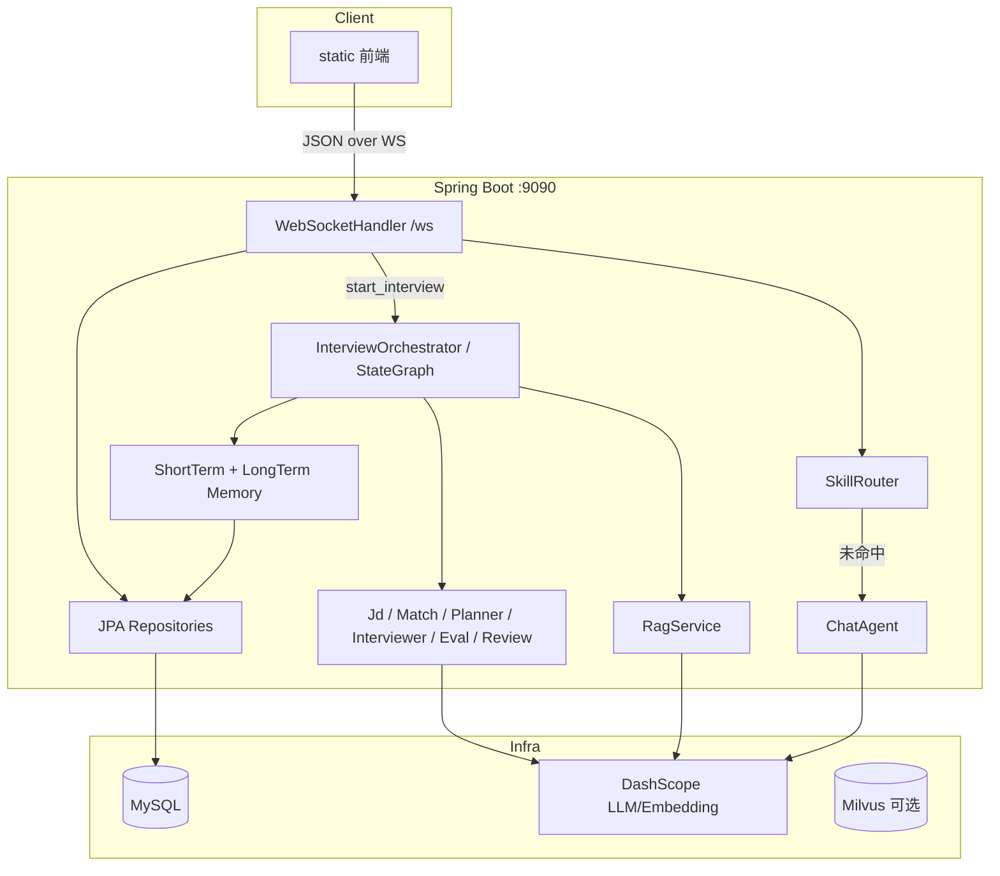
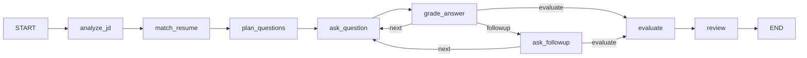

# InterviewAgent 架构文档

<!-- AUTO-GENERATED: architecture -->

## Overview

InterviewAgent 是面向校招/初级 Java 开发者的 **AI 模拟面试系统**。  
采用 **多 Agent 协作 + Spring AI Alibaba StateGraph 编排**，完成：日常聊天引导 → JD/简历分析 → 题库优先出题 → 多轮面试与追问 → 评估报告 → 复习计划。

主入口为嵌入式前端（`static/`）+ WebSocket（`/ws`），后端为单一 Spring Boot 单体应用。

## Tech Stack

| 层 | 技术 | 版本/说明 |
|----|------|-----------|
| 语言 | Java | 20 |
| 框架 | Spring Boot | 3.4.1 |
| AI | Spring AI Alibaba（Agent Framework + DashScope） | 1.1.2.0 |
| 编排 | StateGraph（`spring-ai-alibaba-graph-core`） | 随 Agent Framework |
| LLM / Embedding | 通义千问 DashScope | 默认 `qwen-plus` / `text-embedding-v3` |
| 持久化 | MySQL 8 + Spring Data JPA | 库名 `interview_agent`，`ddl-auto: update` |
| 向量（可选） | Milvus | 默认关闭，MVP 用内存向量 |
| 缓存 | Redis（compose 已备） | 当前应用启动排除 Redis 自动配置，未使用 |
| 交互 | WebSocket + 静态前端 | 端口默认 9090 |
| 构建/部署 | Maven、Docker Compose、Dockerfile | Makefile 封装常用命令 |

## Architecture Pattern

- **形态**：单体后端 + 内置静态前端（非微服务）
- **交互**：WebSocket 为主，少量 REST（`/health`、可选 `/api/login|register`）
- **AI 编排**：StateGraph 有向图；人机等待通过 `AnswerBridge` 桥接
- **检索**：内存 BM25 + Embedding 向量召回 + LLM 重排（题库优先，未命中再生成）

## Package Map

```
com.interview.agent
├── Application.java          # 启动；排除 Redis 自动配置
├── agent/                    # 七个 Agent（Chat + 面试流水线）
├── graph/                    # StateGraph 编排、难度、答题桥接
├── skill/                    # 可插拔 Skill（与 Chat 并列）
├── rag/                      # 题库检索：BM25 / 向量 / 重排
├── loader/                   # JD / 简历 / 题库解析
├── memory/                   # 短期聊天窗口、长期薄弱点
├── handler/                  # WebSocket 协议路由
├── model/ + entity/          # DTO 与 JPA 实体
├── repository/               # Spring Data JPA
├── auth/                     # JWT（AUTH_ENABLED 可控）
├── config/                   # 安全、Milvus、超时、Key 校验
└── web/                      # HealthController
```

## Component Diagram



## Interview StateGraph

节点与边（见 `InterviewOrchestrator#buildGraph`）：



| 节点 | Agent / 职责 |
|------|----------------|
| `analyze_jd` | `JdAnalysisAgent`：JD → 结构化岗位需求 |
| `match_resume` | `ResumeMatchAgent`：匹配度 / 强项 / 短板 |
| `plan_questions` | `QuestionPlannerAgent`：规划方向 → RAG 题库优先 → LLM 兜底 |
| `ask_question` | `InterviewerAgent` 出题；`AnswerBridge` 等待用户回答 |
| `grade_answer` | 评分；`partial` 可追问一次；动态难度 streak |
| `ask_followup` | 追问并等待第二次回答 |
| `evaluate` | `EvaluationAgent` 多维评估；写薄弱点；低分题参考答案回推 |
| `review` | `ReviewPlannerAgent` 复习计划（MVP 不调用 GitHub MCP） |

人机协作：`ask_*` 节点通过 `AnswerBridge.prepare/await`，WebSocket `answer` 消息 `submit` 唤醒图执行。

## Agent Responsibilities

| Agent | 触发场景 | 说明 |
|-------|----------|------|
| ChatAgent | `chat` 且未命中 Skill | 日常答疑、引导去「开始面试」 |
| JdAnalysisAgent | Graph | 结构化 JD |
| ResumeMatchAgent | Graph | 简历-岗位匹配报告 |
| QuestionPlannerAgent | Graph | 两阶段出题（方向 + 检索/生成） |
| InterviewerAgent | Graph | 提问、判分、追问 |
| EvaluationAgent | Graph | 终评 |
| ReviewPlannerAgent | Graph | 复习计划 |

并列 Skill（消息优先匹配）：

- `QuickQuizSkill`：快速测验（多轮）
- `KnowledgeExplainSkill`：知识点讲解

## RAG Design

```
上传题库 → QuestionBankLoader（本地题/答、JSON，失败才 LLM）
         → RagService.upsertBank
         → Bm25Index + InMemoryVectorStore（Embedding）
出题时   → 向量 + BM25 合并去重 → LlmReranker → 原题照搬（BANK）
         → 未命中 → LLM 生成（GENERATED）
```

- 默认 **不依赖 Milvus**（`MILVUS_ENABLED=false`）
- 题库在进程内存中，**重启丢失**，需重新上传（示例：`question.md`）

## Data & Storage

### MySQL（JPA 自动建表）

| 表 | 内容 | 写入时机 |
|----|------|----------|
| `users` | 用户名/密码哈希 | `/api/register`（鉴权开启时） |
| `interview_sessions` | JD、简历、匹配/评估/复习 JSON、状态 | 开始/结束面试 |
| `weakness_records` | 薄弱 topic + hitCount | 评估完成后 |

### 非持久化

| 数据 | 位置 |
|------|------|
| 题库全文与向量 | JVM 内存 |
| 聊天短期历史（20 条） | `ShortTermMemory` |
| 面试进行中 Graph 状态 | Orchestrator / OverAllState |

## Request Data Flow

### 聊天

1. 浏览器 WS → `type=chat`
2. `SkillRouter`：active skill → match → 否则 `ChatAgent`
3. 回推 `type=chat`

### 模拟面试

1. `start_interview`（JD 文本或 URL + 简历文本/文件）
2. 落库 `interview_sessions`，异步 `InterviewOrchestrator.run`
3. 各节点经 `InterviewEventSink` 推送 `phase` / `question` / `grade` / …
4. 用户 `answer` → `AnswerBridge` → 图继续
5. 结束写评估/复习 JSON，推送 `done`

### 题库上传

1. `upload_questions`（base64 文件）
2. 解析入库内存 RAG，返回 `upload_result`

## Key Design Decisions

| 决策 | 选择 | 原因 |
|------|------|------|
| 多 Agent 而非单 Prompt | 职责拆分 | 避免角色过载、便于单独调 Prompt |
| StateGraph | Spring AI Alibaba Graph | 显式阶段与条件边（追问/下一题/评估） |
| 题库优先 | 命中原题不改写 | 保证参考答案忠实 |
| 内存 RAG | 默认关 Milvus | 降低本地依赖，便于演示 |
| 鉴权默认关 | `AUTH_ENABLED=false` | 本地联调简单 |
| Jetty 长超时 | `DASHSCOPE_READ_TIMEOUT` | 长提示避免 10s Total timeout |

## Known Gaps / Roadmap

- GitHub MCP 复习资源检索（预留配置，MVP 未接）
- Redis 长期会话缓存（compose 有服务，应用暂未用）
- Milvus 持久化题库（可选开关已留）
- 面试会话绑定登录用户（当前 `userId` 常为 null）
- 离线 RAG 评估 CLI（`Application` 预留 `eval` 参数）

## Entry Points for Developers

| 想改什么 | 从这里看 |
|----------|----------|
| WS 协议 | `handler/WebSocketHandler.java` |
| 面试流程 | `graph/InterviewOrchestrator.java` |
| 某个 Agent Prompt | `agent/*Agent.java` |
| 检索策略 | `rag/RagService.java` |
| 前端交互 | `resources/static/js/app.js` |
| 配置项 | `application.yml` + `.env.example` |
