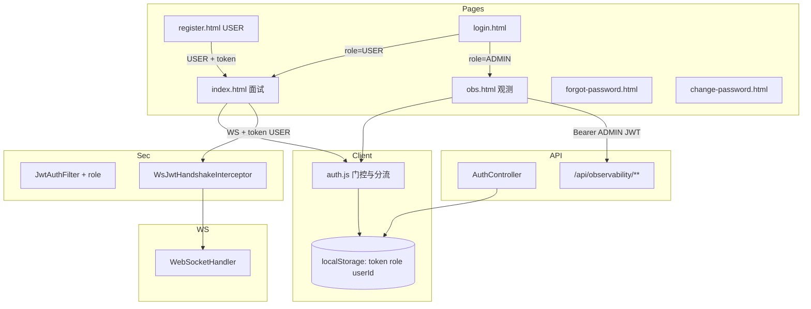

# 登录功能 — 技术方案

> **需求来源：** [需求分析.md](./需求分析.md)  
> **功能短名：** `login`  
> **产出路径：** `docs/login/技术方案.md`  
> **状态：** DRAFT — 技术设计；库表细则 / API 契约字段表 / Task 拆分另项点名  
> **边界：** 写架构选型、模块划分、角色分流、鉴权与页面方案、数据归属、邮件找回；**不写**完整 DDL、接口字段表、实现任务清单  
> **已采纳默认（含原待确认全部拍板）：** 注册成功（USER）自动进面试；WS 仅 USER；密码 ≥8 字母+数字；无 refresh；邮箱找回（邮箱不存在报错）；登录限流；改密强制重登；误入自动跳转落地页；ADMIN 无面试；管理员=环境预置+ADMIN 可创建 ADMIN；观测**仅** ADMIN JWT（**去除** OBS_ADMIN_TOKEN）

---

## 1. 目标与非目标

### 1.1 目标

| 目标 | 技术含义 |
|------|----------|
| 角色区分 | 账号具备 `USER` / `ADMIN`；JWT 携带 `role` |
| 登录分流 | 同一 `login.html`：USER → `index.html`（面试）；ADMIN → `obs.html`（观测） |
| 注册仅 USER | `register.html` 只创建普通用户，成功后进面试界面 |
| 强制登录 | `AUTH_ENABLED=true` 默认；面试与观测界面均需有效 JWT |
| 服务端互斥 | USER 调观测 API → 拒绝；ADMIN 默认不作为面试 WS 目标角色（见 §4.4） |
| 会话保持 | JWT → `localStorage`；无 refresh |
| 数据归属 | USER 的 `userId` 贯穿 WS / 面试 / 薄弱点 / 短期聊天；观测 trace 写入 `userId` |
| 找回/改密 | 邮箱验证码 + 独立改密页 |

### 1.2 非目标

- OAuth / SSO / 第三方登录  
- 多于两角色的 RBAC  
- refresh token  
- 同机一键切换账号  
- 保留或过渡使用 `OBS_ADMIN_TOKEN`（**已拍板去除**）

---

## 2. 现状约束（设计输入）

| 事实 | 影响 |
|------|------|
| 已有 JWT 注册/登录，`users` 无角色字段 | 扩展 `role` + JWT claim |
| 观测 API 现校验 `X-Obs-Admin-Token` | **改为仅 ADMIN JWT**；去除 Admin Token；`obs.html` 登录后带 Bearer |
| `AUTH_ENABLED` 默认 false；`/ws/**` 白名单 | 默认开启；WS 握手验 JWT + 角色策略 |
| 面试侧 `userId` 常 null | WS 从 JWT 注入；trace 同步带上 `userId` |
| 无邮件 / 无 Redis | 重置令牌 MySQL + Spring Mail |

---

## 3. 总体方案

### 3.1 一句话

在现有 JWT 上增加 **USER/ADMIN 角色**：统一登录页按角色跳转 **面试界面 / 观测界面**；服务端按角色保护 `/ws`（仅 USER）与 `/api/observability/**`（仅 ADMIN JWT）；自助注册仅 USER；管理员由种子 + ADMIN 创建；**去除**共享 Admin Token。

### 3.2 架构图



### 3.3 关键决策

| 决策点 | 结论 | 理由 |
|--------|------|------|
| 角色模型 | **`USER` / `ADMIN` 两枚举**，落在用户表 + JWT `role` claim | PRD 只要两角色分流 |
| 登录入口 | **同一登录页**，成功后按 `role` 跳转 | 产品简单 |
| 注册 | **仅 USER**；禁止自助成 ADMIN | 防抬权 |
| 管理员创建 | **环境预置/启动种子** + **ADMIN 可创建另一个 ADMIN** | 已拍板 |
| 观测鉴权 | **仅 ADMIN JWT（Bearer）** | 已拍板完全改造 |
| `OBS_ADMIN_TOKEN` | **去除**（配置与请求头均不再作为观测凭证） | 已拍板 |
| 面试 WS | **仅 USER**；ADMIN 拒绝 | 已拍板无面试能力 |
| 页面误入 | **自动跳到本角色落地页** | 已拍板 |
| 登录限流 | 登录接口限流（防撞库） | 已拍板 |
| 找回邮箱 | 邮箱不存在 → **明确报错**（不隐藏） | 已拍板 |
| 改密后 | **强制重新登录**（清 token + `password_version`+1） | 已拍板 |
| Trace / 统计 `userId` | USER 写入；列表与 **全部 stats** 可选筛 `userId` | 已拍板 |

---

## 4. 角色、鉴权与分流

### 4.1 角色语义

| 角色 | 默认落地页 | 可访问 |
|------|------------|--------|
| `USER` | `index.html` | 面试 WS、改密/找回；**不可**观测 API |
| `ADMIN` | `obs.html` | 观测 API / 观测页 / 创建管理员；**不可**面试 WS |

### 4.2 JWT

| 项 | 方案 |
|----|------|
| Claims | `sub=username`、`uid=userId`、`role`、**`pv=password_version`** |
| 存储 | `localStorage`：`ia_token` / `ia_userId` / `ia_username` / `ia_role` |
| 有效期 | 建议 7 天；**不刷新** |
| 登出 / 改密 | 清 localStorage → `login.html`；服务端校验 `pv` 与库不一致则 401 |

### 4.3 HTTP 与页面门控

| 资源 | `AUTH_ENABLED=true` 时 |
|------|------------------------|
| 登录/注册/找回页与公开 auth API | 白名单 |
| `index.html` + 面试相关 | 需 JWT 且 **role=USER**（否则跳转 obs 或登录） |
| `obs.html` + `/api/observability/**` + 创建管理员 API | 需 JWT 且 **role=ADMIN** |
| `/health` | 白名单 |

前端 `auth.js`：

1. 无 token → `login.html`  
2. 有 token：打开 `index` 但 role=ADMIN → `obs.html`  
3. 有 token：打开 `obs` 但 role=USER → `index.html`  
4. 登录成功：`role==='ADMIN' ? obs : index`

### 4.4 WebSocket

1. `?token=` 握手解析 JWT，attributes 存 `userId` / `username` / `role`  
2. 缺失/无效 → 拒连；前端提示 **「用户未登录」**  
3. `role != USER` → 拒连或回错（文案如「管理员请使用观测界面」）  
4. 业务一律用 attributes 中的 `userId`；写入面试会话、薄弱点、**观测 trace.userId**

### 4.5 观测 API 鉴权（已拍板）

- `ObservabilityAdminFilter`（或等价）：**仅**接受 `Authorization: Bearer` 且 `role=ADMIN`（并校验 `pv`）。  
- **删除**对 `X-Obs-Admin-Token` / `OBS_ADMIN_TOKEN` 的依赖；未登录管理员 → 401。  
- `obs.js`：去掉 Token 输入框主路径，统一用登录后的 JWT。  
- `/api/observability/status` 探活策略可保持「仅受 OBS_ENABLED 约束」（与现网一致）。

---

## 5. 前端页面方案

| 页面 | 角色 | 职责 |
|------|------|------|
| `login.html` | 共用 | 登录；按 role 分流 |
| `register.html` | USER | 注册普通用户 → `index.html` |
| `index.html` | USER | 面试主流程；展示用户名；登出 |
| `obs.html` | ADMIN | 观测界面；登出；不再依赖手填 Token 作为主路径 |
| `forgot-password.html` | 共用 | 邮箱验证码重置 |
| `change-password.html` | 共用 | 已登录改密 |

流转：

```text
register(USER) ──► index
login(USER) ──► index
login(ADMIN) ──► obs
index ──无 token / 非 USER──► login 或 obs
obs ──无 token / 非 ADMIN──► login 或 index
两端均可登出 ──► login
```

---

## 6. 数据归属与全链路 userId

| 能力 | 方案 |
|------|------|
| 面试历史 | `interview_sessions.user_id` = 当前 USER |
| 薄弱点 | 评估写入非空 `userId` |
| 短期聊天 / Skill | 键 `user:{userId}` |
| 观测 trace | `openRootNamed(..., userId)` **必填当前 USER**；ADMIN 查询支持按 `userId` 过滤（若 API 已有则接好，没有则 API 项补） |

管理员不产生面试业务数据（因其不进 WS）；其观测操作本身可不写业务 `userId`，或写管理员 id 到独立操作审计（**MVP 不做审计表**）。

---

## 7. 注册 / 登录 / 管理员供给

| 规则 | 方案 |
|------|------|
| 密码 | ≥8，字母+数字 |
| 注册 | 用户名 + 邮箱 + 密码；**role 固定 USER** |
| 登录错误 | 区分用户不存在 / 密码错误 |
| 登录响应 | `token, userId, username, role`（可加 email） |
| 管理员供给 | 启动种子（环境变量）若不存在则创建 ADMIN；另提供 **ADMIN 调用的创建管理员 API**；自助注册不可成 ADMIN |

---

## 8. 找回 / 改密

与前版相同：邮箱验证码 + MySQL 一次性令牌哈希；改密校验旧密码后强制重登（推荐）。USER/ADMIN 共用流程；重置不改变 `role`。

---

## 9. 模块与改动面（概念）

| 区域 | 改动 |
|------|------|
| `UserEntity` | `email`、`role`（及可选 `passwordVersion`） |
| `JwtService` | 签发/解析 `role` |
| `AuthController` | 注册固定 USER；登录返回 role；找回/改密 |
| `SecurityConfig` / Filter | 角色校验；观测 API 认 ADMIN JWT |
| `ObservabilityAdminFilter` | 仅 JWT(ADMIN)；移除 Admin Token |
| WS 握手 | JWT + USER 角色 |
| `WebSocketHandler` | userId/role；trace 带 userId |
| 种子 + 创建管理员 API | 预置 ADMIN；ADMIN 可再建 ADMIN |
| `static/*` | 登录分流；`obs.js` 仅 JWT；`auth.js` 门控跳转 |
| 邮件与重置表 | 同前 |

---

## 10. 配置与联调

| 变量 | 建议 |
|------|------|
| `AUTH_ENABLED` | 默认 `true` |
| `JWT_SECRET` / 过期 | 必改密钥；建议 7d |
| 管理员种子 | bootstrap 用户名/密码/邮箱 |
| SMTP | 找回密码 |
| ~~`OBS_ADMIN_TOKEN`~~ | **已去除** |

验收脚本（概念）：

1. 注册 USER → 落在 `index`，可 WS 面试；访问观测 API → 403  
2. 种子 ADMIN 登录 → 落在 `obs`，可查 trace；连面试 WS → 拒绝  
3. 两 USER 数据不串；某 USER 面试后的 trace 带其 `userId`，ADMIN 可按该 id 区分

---

## 11. 风险与待确认

| 风险 | 缓解 |
|------|------|
| 前端分流、后端未拦 | API/WS 强制 role |
| 种子管理员弱口令 | 文档强制改密；禁止默认口令进生产 |
| 抬权 | 注册写死 USER；创建 ADMIN 仅 ADMIN 可调 |
| 找回暴露邮箱枚举 | 产品已接受；配合限流 |

**原待确认：已全部关闭**（见需求分析 §8）。

---

## 12. 与后续文档分界

| 项 | 状态 |
|----|------|
| 数据库设计 / API 设计 | 已有文档，并随本次拍板同步修订 |
| Task / 编码 | 未做（需点名） |

---

*Status: DRAFT — 仅技术方案。请审查；若要改设计点直接说明（仍做本项）。*
