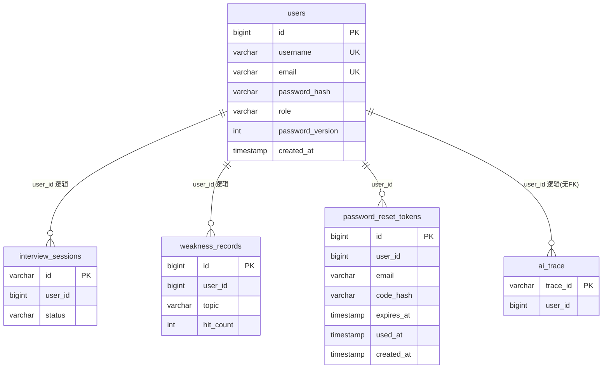

# 登录功能 — 数据库设计

> **需求来源：** [需求分析.md](./需求分析.md) · [技术方案.md](./技术方案.md) · [API设计.md](./API设计.md)  
> **功能短名：** `login`  
> **产出路径：** `docs/login/数据库设计.md`  
> **状态：** DRAFT — 库表设计；原待确认已拍板并写入  
> **库：** MySQL 8 · 库名沿用 `interview_agent`  
> **落地方式：** 与现网一致，优先 JPA Entity + `spring.jpa.hibernate.ddl-auto=update`；下文 DDL 为权威结构说明（便于评审与手工建库）

---

## 1. 设计目标

| 目标 | 库表侧做法 |
|------|------------|
| USER / ADMIN 角色 | `users.role` 存枚举字符串，注册固定 `USER` |
| 邮箱找回密码 | `users.email` 唯一；`password_reset_tokens` 存验证码哈希与过期 |
| 改密后旧 JWT 可失效（可选增强） | `users.password_version`；JWT 带同号 claim，校验时比对 |
| 个人数据归属 | 沿用并强化 `interview_sessions.user_id`、`weakness_records.user_id`；观测 `ai_trace.user_id` 逻辑关联 |
| 兼容现网 | 扩展 `users`，不推倒重建；历史无邮箱行需迁移策略 |

**非目标：**

- JWT 黑名单表 / refresh token 表（API 约定无 refresh）
- 管理员操作审计表
- 短期聊天落库（仍进程内 `ShortTermMemory`）
- 对业务表建强制物理 FK 到 `users`（避免删用户级联拖垮面试/观测；用逻辑关联 + 应用层校验）

---

## 2. ER 概览



说明：

- `password_reset_tokens.user_id`：**建议建物理 FK → users.id**（ON DELETE CASCADE），令牌随用户清理。  
- `interview_sessions` / `weakness_records` / `ai_trace` 的 `user_id`：**逻辑关联** `users.id`，**不建物理 FK**（与全链路观测库表设计一致）。

---

## 3. 表定义

### 3.1 `users` — 扩展（既有表）

现网已有：`id`、`username`、`password_hash`、`created_at`。  
本需求新增：`email`、`role`、`password_version`。

| 列名 | 类型 | 空 | 默认 | 说明 |
|------|------|----|------|------|
| `id` | `BIGINT` | NO | AI | PK |
| `username` | `VARCHAR(64)` | NO | — | 唯一；登录名 |
| `email` | `VARCHAR(255)` | NO* | — | 唯一；找回密码；注册必填 |
| `password_hash` | `VARCHAR(255)` | NO | — | BCrypt |
| `role` | `VARCHAR(16)` | NO | `'USER'` | `USER` \| `ADMIN` |
| `password_version` | `INT` | NO | `0` | **MVP 必做**：改密/重置后 +1；JWT 带 `pv`，不一致则 401 |
| `created_at` | `DATETIME(3)` | NO | CURRENT_TIMESTAMP(3) | 创建时间 |

\* 迁移期：历史无邮箱用户允许 `email` 暂为 `NULL`，登录后**提示绑定邮箱**（`POST /api/me/bind-email`），绑定前限制找回密码。**新注册用户 `email` 必填。** 全部绑定完成后可将列改为 `NOT NULL`。

```sql
-- 新环境完整建表（或与 JPA 对齐后的目标态）
CREATE TABLE users (
    id               BIGINT       NOT NULL AUTO_INCREMENT,
    username         VARCHAR(64)  NOT NULL,
    email            VARCHAR(255) NULL COMMENT '新用户必填；历史可空至绑定',
    password_hash    VARCHAR(255) NOT NULL,
    role             VARCHAR(16)  NOT NULL DEFAULT 'USER',
    password_version INT          NOT NULL DEFAULT 0,
    created_at       DATETIME(3)  NOT NULL DEFAULT CURRENT_TIMESTAMP(3),
    PRIMARY KEY (id),
    UNIQUE KEY uk_users_username (username),
    UNIQUE KEY uk_users_email (email),
    KEY idx_users_role (role)
) ENGINE=InnoDB DEFAULT CHARSET=utf8mb4 COLLATE=utf8mb4_unicode_ci;
```

**从现网增量迁移（示例）：**

```sql
ALTER TABLE users
    ADD COLUMN email VARCHAR(255) NULL AFTER username,
    ADD COLUMN role VARCHAR(16) NOT NULL DEFAULT 'USER' AFTER password_hash,
    ADD COLUMN password_version INT NOT NULL DEFAULT 0 AFTER role;

-- 为历史行填占位邮箱后再加唯一与非空（按环境选择）
-- UPDATE users SET email = CONCAT('legacy+', id, '@invalid.local') WHERE email IS NULL;
-- ALTER TABLE users MODIFY email VARCHAR(255) NOT NULL;
-- ALTER TABLE users ADD UNIQUE KEY uk_users_email (email);
```

**角色取值约束（应用层强制；可选 DB CHECK，MySQL 8.0.16+）：**

```sql
-- 可选
-- ALTER TABLE users ADD CONSTRAINT chk_users_role CHECK (role IN ('USER', 'ADMIN'));
```

**种子管理员：** 不另建表；启动时若不存在指定 `username`，插入一行 `role='ADMIN'`（密码来自环境变量）。邮箱可用配置邮箱或 `admin@localhost` 类占位（须满足唯一）。

---

### 3.2 `password_reset_tokens` — 新建

邮箱验证码重置密码用。验证码**只存哈希**：已拍板采用 **SHA-256(email + code + pepper)**（或等价拼接），明文只走邮件通道；**不用 BCrypt 存短码**。

| 列名 | 类型 | 空 | 默认 | 说明 |
|------|------|----|------|------|
| `id` | `BIGINT` | NO | AI | PK |
| `user_id` | `BIGINT` | NO | — | 目标用户；FK → users.id |
| `email` | `VARCHAR(255)` | NO | — | 请求时邮箱（冗余，便于排查） |
| `code_hash` | `VARCHAR(255)` | NO | — | 验证码哈希 |
| `expires_at` | `DATETIME(3)` | NO | — | 过期时间（建议创建后 10–15 分钟） |
| `used_at` | `DATETIME(3)` | YES | NULL | 使用成功时间；非空表示已消费 |
| `fail_count` | `INT` | NO | `0` | 校验失败次数；超限作废 |
| `created_at` | `DATETIME(3)` | NO | CURRENT_TIMESTAMP(3) | 发送时间 |

```sql
CREATE TABLE password_reset_tokens (
    id         BIGINT       NOT NULL AUTO_INCREMENT,
    user_id    BIGINT       NOT NULL,
    email      VARCHAR(255) NOT NULL,
    code_hash  VARCHAR(255) NOT NULL,
    expires_at DATETIME(3)  NOT NULL,
    used_at    DATETIME(3)  NULL,
    fail_count INT          NOT NULL DEFAULT 0,
    created_at DATETIME(3)  NOT NULL DEFAULT CURRENT_TIMESTAMP(3),
    PRIMARY KEY (id),
    KEY idx_prt_user_created (user_id, created_at),
    KEY idx_prt_email_created (email, created_at),
    KEY idx_prt_expires (expires_at),
    CONSTRAINT fk_prt_user FOREIGN KEY (user_id) REFERENCES users (id) ON DELETE CASCADE
) ENGINE=InnoDB DEFAULT CHARSET=utf8mb4 COLLATE=utf8mb4_unicode_ci;
```

**使用规则（应用层，非 DDL）：**

1. 同一邮箱短时间多次申请：可作废未使用旧码或只保留最新一条有效。  
2. 校验成功：写 `used_at`，更新 `users.password_hash`，`password_version = password_version + 1`。  
3. 定期删除：`expires_at < now()` 或 `used_at IS NOT NULL` 的过期行（可用定时任务；MVP 可懒清理）。

---

### 3.3 `interview_sessions` — 既有（归属强化，结构基本不变）

| 列名 | 类型 | 空 | 说明 |
|------|------|----|------|
| `id` | `VARCHAR(64)` | NO | PK |
| `user_id` | `BIGINT` | YES → 新流量 NO 语义 | 逻辑关联 users；强制登录后写入非空 |
| `status` | `VARCHAR(32)` | YES | 如 `RUNNING` / 结束态 |
| `jd_text` / `resume_text` / JSON 字段等 | LOB | YES | 既有，本需求不改列 |
| `created_at` / `finished_at` | 时间 | | 既有 |

**建议索引（若尚无）：**

```sql
CREATE INDEX idx_interview_sessions_user_created
    ON interview_sessions (user_id, created_at);
```

历史 `user_id IS NULL`：保留不迁移；新会话必须带 USER id。

---

### 3.4 `weakness_records` — 既有（归属强化）

| 列名 | 类型 | 说明 |
|------|------|------|
| `id` | `BIGINT` PK | |
| `user_id` | `BIGINT` | 逻辑关联 users；写入时非空 |
| `topic` | `VARCHAR(128)` | |
| `hit_count` | `INT` | |
| `updated_at` | 时间 | |

**已拍板：增加 `(user_id, topic)` 唯一约束**（清洗重复行后执行）：

```sql
ALTER TABLE weakness_records
  ADD UNIQUE KEY uk_weakness_user_topic (user_id, topic);

CREATE INDEX idx_weakness_user_hits
    ON weakness_records (user_id, hit_count);
```

---

### 3.5 `ai_trace` — 既有（登录侧只约定填充，不改表形）

| 列名 | 说明 |
|------|------|
| `user_id` | 已存在且可空；**USER 业务流量应写入非空**；已有 `idx_ai_trace_user_started (user_id, started_at)` 支撑按用户筛选 |

本需求**不新增观测表**。表结构权威说明见 [ai_full_link_analysis/db_design](../ai_full_link_analysis/db_design_ai_full_link_analysis.md)。

---

## 4. 不落库的数据

| 数据 | 位置 | 说明 |
|------|------|------|
| JWT | 客户端 localStorage | 服务端不存会话行 |
| 短期聊天 / Skill 会话 | JVM `user:{userId}` | 重启丢失；按用户隔离 |
| 题库向量 | 内存 | 与登录无关 |
| ~~`OBS_ADMIN_TOKEN`~~ | — | **已去除**，非表字段也不再使用 |

---

## 5. 与 API / 角色的映射

| API / 行为 | 读/写表 |
|------------|---------|
| `POST /api/register` | INSERT `users`（role=USER） |
| `POST /api/login` | SELECT `users` by username |
| `POST /api/password/forgot/send-code` | SELECT `users` by email；INSERT `password_reset_tokens` |
| `POST /api/password/forgot/reset` | 校验 tokens；UPDATE `users.password_hash` + `password_version`；UPDATE token.used_at |
| `POST /api/password/change` | 校验旧密码；UPDATE hash + version |
| `GET /api/me` | SELECT `users` by JWT uid |
| WS `start_interview` 等 | INSERT/UPDATE `interview_sessions.user_id`；评估写 `weakness_records`；观测写 `ai_trace.user_id` |
| ADMIN 登录 | 仅读 `users`；不写面试表 |

---

## 6. 安全与清理

| 项 | 约定 |
|----|------|
| 密码 | 仅 BCrypt 哈希；禁止明文 |
| 验证码 | 仅哈希入库；TTL 短；`fail_count` 上限（如 5）后作废 |
| 邮箱唯一 | 防止多账号共用找回入口歧义 |
| `password_version` | 改密/重置后旧 JWT 在服务端校验失败（需 JwtFilter 读库或缓存 version；实现细节归编码） |
| 令牌清理 | 按 `expires_at` / `used_at` 定期删 |
| 删用户 | MVP 可不提供删号 API；若删，tokens 级联删；业务表 user_id 变孤儿，可接受或后续归档任务处理 |

---

## 7. 迁移与兼容检查清单

- [ ] `users` 增加 `email` / `role` / `password_version`
- [ ] 历史用户邮箱回填或清理后加 `NOT NULL` + `UNIQUE`
- [ ] 新建 `password_reset_tokens`
- [ ] `interview_sessions` / `weakness_records` 补 `user_id` 索引（若缺失）
- [ ] 种子 ADMIN 行可插入（唯一 username/email）
- [ ] JPA Entity 与 DDL 列名一致（`password_hash` ↔ `passwordHash` 等）
- [ ] 本地 `ddl-auto=update` 验证可启动；生产若关 auto-ddl 则执行脚本

---

## 8. 已拍板结论（原待确认）

| 议题 | 结论 |
|------|------|
| 历史无邮箱用户 | **提示绑定邮箱**（`bind-email`），非占位邮箱、非强制重注册 |
| `password_version` | **MVP 必做** |
| `weakness_records` 唯一约束 | **添加** `(user_id, topic)` |
| 验证码哈希 | **SHA-256(+pepper)** |

---

*Status: DRAFT — 数据库设计（待确认已关闭）。*
